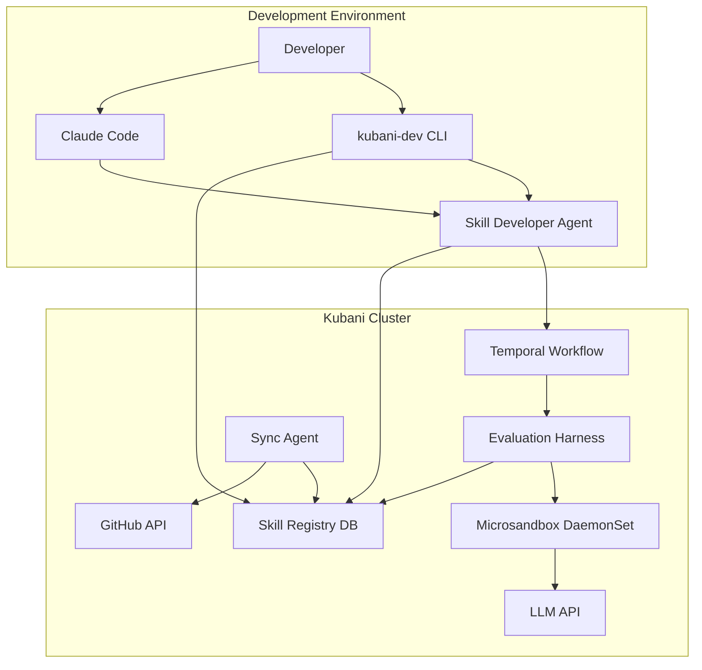

# Kubani Skill Development Workflow - Comprehensive Implementation Plan

**Author:** Manus AI  
**Date:** January 20, 2026  
**Branch:** `feature/manus-skill-eval`

## 1. Executive Summary

This document provides a comprehensive, step-by-step implementation plan for the Kubani Skill Development Workflow. The system will enable developers and agents to create, evaluate, and continuously improve skills through a hybrid approach that works seamlessly with both Claude Code and the Kubani cluster.

### Key Features

- **Unified Development Workspace:** Symlinked directory structure enabling simultaneous access from Claude Code and cluster tools
- **Secure Evaluation:** Hardware-isolated execution using `microsandbox` (local and cluster)
- **Hybrid Storage:** Latest evaluation results in Git, full history in database
- **Automated Sync:** PR-based synchronization for cluster-generated skill improvements
- **Agent-Driven Workflow:** Intelligent Skill Developer Agent for conversational skill creation
- **CLI Tooling:** Extended `kubani-dev` CLI for scriptable operations

## 2. Architecture Overview

### 2.1. System Components



### 2.2. Directory Structure

```
kubani/
├── .claude/
│   └── skills/
│       └── development -> ../../skills/development  # Symlink
├── skills/
│   ├── development/                    # Unified workspace for active development
│   │   └── find-unused-configmaps/
│   │       ├── SKILL.md
│   │       ├── skill.py
│   │       ├── test_cases.yaml
│   │       └── latest_eval.json
│   ├── core/                           # General-purpose, cross-agent skills
│   │   └── post-to-discord/
│   │       └── v1.0.0/
│   │           ├── SKILL.md
│   │           ├── skill.py
│   │           ├── test_cases.yaml
│   │           └── latest_eval.json
│   └── agents/                         # Agent-specific skills
│       └── k8s-monitor/
│           └── find-unused-configmaps/
│               └── v1.0.0/
│                   ├── SKILL.md
│                   ├── skill.py
│                   ├── test_cases.yaml
│                   └── latest_eval.json
└── tools/
    └── kubani-dev/
        └── src/
            └── kubani_dev/
                └── commands/
                    └── skill.py        # New skill management commands
```

### 2.3. Database Schema

```sql
-- Skill Registry Extension
CREATE TABLE skills (
    id SERIAL PRIMARY KEY,
    name VARCHAR(255) NOT NULL,
    version VARCHAR(50) NOT NULL,
    category VARCHAR(50) NOT NULL,  -- 'core', 'agent-specific', 'community'
    agent_name VARCHAR(255),         -- NULL for core skills
    description TEXT,
    schema_input JSONB,
    schema_output JSONB,
    code_path VARCHAR(500),
    status VARCHAR(50),              -- 'development', 'approved', 'deprecated'
    created_at TIMESTAMP DEFAULT NOW(),
    updated_at TIMESTAMP DEFAULT NOW(),
    UNIQUE(name, version)
);

-- Evaluation History
CREATE TABLE skill_evaluations (
    id SERIAL PRIMARY KEY,
    skill_id INTEGER REFERENCES skills(id),
    evaluated_at TIMESTAMP DEFAULT NOW(),
    evaluator VARCHAR(100),          -- 'human', 'agent', 'automated'
    
    -- Metrics
    accuracy FLOAT,
    avg_latency_ms FLOAT,
    p95_latency_ms FLOAT,
    avg_token_usage INTEGER,
    cost_per_run_usd FLOAT,
    
    -- Test Results
    test_cases_total INTEGER,
    test_cases_passed INTEGER,
    test_cases_failed INTEGER,
    
    -- Artifacts
    report_markdown TEXT,
    raw_results JSONB,
    
    -- Metadata
    sandbox_type VARCHAR(50),        -- 'microsandbox', 'k8s-job', 'local-docker'
    execution_environment JSONB
);

-- Sync Status
CREATE TABLE skill_sync_status (
    id SERIAL PRIMARY KEY,
    skill_id INTEGER REFERENCES skills(id),
    sync_status VARCHAR(50),         -- 'pending', 'pr-created', 'merged', 'failed'
    pr_url VARCHAR(500),
    pr_number INTEGER,
    created_at TIMESTAMP DEFAULT NOW(),
    synced_at TIMESTAMP
);
```

## 3. Implementation Phases

### Phase 1: Foundation & Infrastructure (Week 1)

**Objective:** Set up the basic directory structure, symlinks, and CLI scaffolding.

#### 1.1. Directory Structure Setup

**Tasks:**
- Create `skills/development/` directory
- Create symlink: `.claude/skills/development -> ../../skills/development`
- Add `.gitkeep` files to maintain directory structure
- Update `.gitignore` to handle evaluation artifacts appropriately

**Deliverables:**
- Updated directory structure in `feature/manus-skill-eval` branch
- Documentation in `skills/README.md` explaining the structure

**Commands:**
```bash
cd /home/ubuntu/kubani
mkdir -p skills/development skills/core skills/agents
ln -s ../../skills/development .claude/skills/development
touch skills/development/.gitkeep
```

#### 1.2. CLI Extension - Basic Commands

**Tasks:**
- Extend `kubani-dev` CLI with `skill` subcommand group
- Implement basic commands:
  - `kubani-dev skill draft <name>` - Create new skill from template
  - `kubani-dev skill list` - List all skills and their status
  - `kubani-dev skill info <name>` - Show skill details

**Files to Create/Modify:**
- `tools/kubani-dev/src/kubani_dev/commands/skill.py`
- `tools/kubani-dev/src/kubani_dev/templates/SKILL.md.j2`
- `tools/kubani-dev/src/kubani_dev/templates/skill.py.j2`
- `tools/kubani-dev/src/kubani_dev/templates/test_cases.yaml.j2`

**Deliverables:**
- Working CLI commands for skill drafting and listing
- Template files for new skills

#### 1.3. Database Schema Implementation

**Tasks:**
- Create migration scripts for new tables
- Extend existing registry database
- Create Python models using SQLAlchemy/Pydantic

**Files to Create:**
- `registry/migrations/001_skill_evaluation_schema.sql`
- `registry/src/registry/models/skill.py`
- `registry/src/registry/models/evaluation.py`

**Deliverables:**
- Database migration scripts
- Python ORM models for skills and evaluations

### Phase 2: Microsandbox Integration (Week 2)

**Objective:** Integrate `microsandbox` for secure local and cluster-based evaluation.

#### 2.1. Local Microsandbox Setup

**Tasks:**
- Add `microsandbox` Python SDK to dependencies
- Create wrapper class for microsandbox operations
- Implement local evaluation runner
- Add `kubani-dev skill eval --local` command

**Files to Create:**
- `tools/kubani-dev/src/kubani_dev/sandbox/microsandbox_runner.py`
- `tools/kubani-dev/src/kubani_dev/sandbox/evaluator.py`

**Dependencies:**
```python
# Add to tools/kubani-dev/pyproject.toml
[tool.poetry.dependencies]
microsandbox = "^0.2.6"
```

**Deliverables:**
- Working local evaluation using microsandbox
- CLI command: `kubani-dev skill eval <name> --local`

#### 2.2. Cluster Microsandbox Deployment

**Tasks:**
- Create Kubernetes DaemonSet manifest for microsandbox
- Configure node selectors and tolerations
- Set up RBAC and security policies
- Deploy to cluster

**Files to Create:**
- `gitops/apps/base/microsandbox/daemonset.yaml`
- `gitops/apps/base/microsandbox/rbac.yaml`
- `gitops/apps/base/microsandbox/service.yaml`

**Deliverables:**
- Microsandbox running on all cluster nodes
- Service endpoint for evaluation harness to connect

#### 2.3. Evaluation Harness - Temporal Activity

**Tasks:**
- Create Temporal activity for skill evaluation
- Implement connection to microsandbox service
- Add metrics collection and result storage
- Generate `latest_eval.json` file

**Files to Create:**
- `agents/core/src/core_agents/activities/skill_evaluation.py`
- `agents/core/src/core_agents/workflows/skill_lifecycle.py`

**Deliverables:**
- Working Temporal workflow for skill evaluation
- Automatic storage of results in database and Git

### Phase 3: Skill Lifecycle Management (Week 3)

**Objective:** Implement the complete skill lifecycle from development to production.

#### 3.1. Skill Promotion & Versioning

**Tasks:**
- Implement `kubani-dev skill promote <name>` command
- Add semantic versioning logic
- Create version directories automatically
- Move skills from `development/` to `core/` or `agents/`

**Files to Modify:**
- `tools/kubani-dev/src/kubani_dev/commands/skill.py`

**Deliverables:**
- Working skill promotion workflow
- Automatic version directory creation

#### 3.2. Registry Integration

**Tasks:**
- Implement skill registration API
- Add `kubani-dev skill register <name>` command
- Create registry sync utilities
- Implement skill discovery for agents

**Files to Create/Modify:**
- `registry/src/registry/api/skills.py`
- `tools/kubani-dev/src/kubani_dev/commands/skill.py`

**Deliverables:**
- Skills can be registered and discovered via registry
- Agents can query and execute registered skills

#### 3.3. Evaluation History & Reporting

**Tasks:**
- Implement `kubani-dev skill eval-history <name>` command
- Create evaluation comparison tool
- Generate markdown reports from evaluation data
- Add visualization of metrics over time

**Files to Create:**
- `tools/kubani-dev/src/kubani_dev/commands/skill_eval.py`
- `tools/kubani-dev/src/kubani_dev/reporting/eval_report.py`

**Deliverables:**
- CLI commands for viewing evaluation history
- Rich markdown reports with metrics and trends

### Phase 4: Agent-Driven Workflow (Week 4)

**Objective:** Implement the Skill Developer Agent for conversational skill creation.

#### 4.1. Skill Developer Agent Core

**Tasks:**
- Create new agent type: Skill Developer
- Implement conversational skill creation flow
- Add synthetic test case generation
- Integrate with Temporal workflows

**Files to Create:**
- `agents/skill-developer/src/skill_developer/agent.py`
- `agents/skill-developer/src/skill_developer/prompts/`
- `.claude/skills/skill-developer/SKILL.md`

**Deliverables:**
- Working Skill Developer Agent
- Accessible via Claude Code and CLI

#### 4.2. Code Generation & Improvement

**Tasks:**
- Implement skill code generation from natural language
- Add iterative improvement based on eval results
- Create critic function for code quality
- Integrate with LLM API

**Files to Create:**
- `agents/skill-developer/src/skill_developer/generators/code_gen.py`
- `agents/skill-developer/src/skill_developer/critics/skill_critic.py`

**Deliverables:**
- Agent can generate skill code from descriptions
- Agent can suggest improvements based on evaluations

#### 4.3. Test Case Generation

**Tasks:**
- Implement synthetic test case generation
- Add diversity and edge case coverage
- Generate expected outputs using LLM
- Store in `test_cases.yaml` format

**Files to Create:**
- `agents/skill-developer/src/skill_developer/generators/test_gen.py`

**Deliverables:**
- Automatic generation of comprehensive test cases
- Configurable test case difficulty and coverage

### Phase 5: Automated Synchronization (Week 5)

**Objective:** Implement the Sync Agent for automated PR creation.

#### 5.1. Sync Agent Implementation

**Tasks:**
- Create Sync Agent to monitor registry changes
- Implement GitHub API integration
- Add automatic branch creation and PR submission
- Configure PR templates and descriptions

**Files to Create:**
- `agents/sync-agent/src/sync_agent/agent.py`
- `agents/sync-agent/src/sync_agent/github_client.py`
- `.github/PULL_REQUEST_TEMPLATE/skill_sync.md`

**Deliverables:**
- Sync Agent running in cluster
- Automatic PR creation for skill updates

#### 5.2. Conflict Resolution & Validation

**Tasks:**
- Implement conflict detection for concurrent edits
- Add validation checks before PR creation
- Create rollback mechanisms
- Add notification system (Discord integration)

**Files to Create:**
- `agents/sync-agent/src/sync_agent/validators.py`
- `agents/sync-agent/src/sync_agent/conflict_resolver.py`

**Deliverables:**
- Robust conflict handling
- Notifications for sync events

### Phase 6: Testing & Documentation (Week 6)

**Objective:** Comprehensive testing and documentation.

#### 6.1. End-to-End Testing

**Tasks:**
- Create test suite for CLI commands
- Test local and cluster evaluation flows
- Test agent-driven workflows
- Test sync agent PR creation
- Load testing for microsandbox

**Files to Create:**
- `tests/integration/test_skill_lifecycle.py`
- `tests/integration/test_evaluation_harness.py`
- `tests/integration/test_sync_agent.py`

**Deliverables:**
- Comprehensive test suite
- CI/CD integration for automated testing

#### 6.2. Documentation

**Tasks:**
- Write user guide for skill development
- Document CLI commands
- Create architecture diagrams
- Write troubleshooting guide
- Add inline code documentation

**Files to Create:**
- `docs/skill-development-guide.md`
- `docs/architecture/skill-workflow.md`
- `docs/cli-reference.md`
- `docs/troubleshooting.md`

**Deliverables:**
- Complete documentation set
- Developer onboarding guide

## 4. Success Criteria

### 4.1. Functional Requirements

- [ ] Developers can create skills using Claude Code
- [ ] Skills can be evaluated locally using microsandbox
- [ ] Skills can be evaluated in cluster using microsandbox
- [ ] Evaluation results are stored in database and Git
- [ ] Skills can be promoted from development to production
- [ ] Skills are registered and discoverable by agents
- [ ] Cluster-generated improvements create automatic PRs
- [ ] Skill Developer Agent can create skills conversationally

### 4.2. Performance Requirements

- [ ] Local evaluation completes in < 30 seconds
- [ ] Cluster evaluation completes in < 2 minutes
- [ ] Microsandbox startup time < 200ms
- [ ] CLI commands respond in < 1 second
- [ ] Sync Agent creates PRs within 5 minutes of registry update

### 4.3. Security Requirements

- [ ] All skill code executes in isolated microsandbox
- [ ] No privilege escalation possible from sandbox
- [ ] GitHub API credentials securely stored
- [ ] Database connections encrypted
- [ ] Audit logging for all skill operations

## 5. Risk Mitigation

| Risk | Impact | Probability | Mitigation |
|------|--------|-------------|------------|
| Microsandbox compatibility issues | High | Medium | Test on multiple nodes, have K8s Jobs fallback |
| Git conflicts from sync agent | Medium | Medium | Implement robust conflict detection and resolution |
| Database performance degradation | Medium | Low | Index optimization, query caching, archival strategy |
| Symlink issues on non-Unix systems | Low | Low | Document requirements, provide alternative setup |
| LLM API rate limits | Medium | Medium | Implement retry logic, queue management |

## 6. Rollout Plan

### 6.1. Alpha (Internal Testing)

- Deploy to development cluster
- Test with 2-3 simple skills
- Gather feedback from core team
- Iterate on UX and bugs

### 6.2. Beta (Limited Release)

- Deploy to production cluster
- Enable for k8s-monitor agent
- Create 5-10 production skills
- Monitor performance and stability

### 6.3. General Availability

- Full documentation published
- All agents can use skill system
- Community contributions enabled
- Monitoring and alerting in place

## 7. Maintenance & Operations

### 7.1. Monitoring

- Microsandbox health checks
- Evaluation success/failure rates
- Database query performance
- Sync agent PR creation metrics
- Skill execution metrics in production

### 7.2. Backup & Recovery

- Daily database backups
- Git repository as source of truth
- Skill registry snapshots
- Disaster recovery procedures

### 7.3. Upgrades & Migrations

- Microsandbox version updates
- Database schema migrations
- Backward compatibility for skills
- Deprecation policy for old skill versions

## 8. Next Steps

1. **Review & Approval:** Team reviews this plan and provides feedback
2. **Kickoff:** Begin Phase 1 implementation
3. **Weekly Sync:** Progress reviews and adjustments
4. **Milestone Demos:** Demo after each phase completion
5. **Launch:** Full rollout after Phase 6 completion

---

**Document Status:** Ready for Review  
**Last Updated:** January 20, 2026  
**Next Review:** Upon approval to begin implementation
