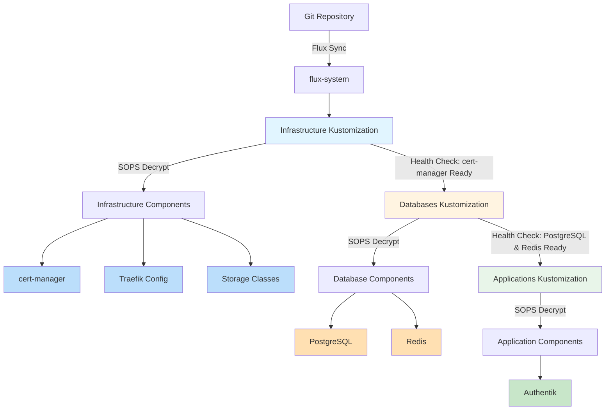

# Deployment Order and Dependencies

This document describes the deployment order and dependency chain for services in the cluster.

## Deployment Flow



## Dependency Chain

### Level 1: Infrastructure (No Dependencies)

**Kustomization**: `infrastructure`
**Path**: `./gitops/infrastructure`
**SOPS Decryption**: ✅ Enabled
**Dependencies**: None
**Health Checks**: cert-manager HelmRelease

**Components**:
- cert-manager (TLS certificate automation)
- Traefik configuration (TCP routing for databases)
- Storage provisioners
- Network policies

**Why First?**
- Provides foundational services required by all other components
- cert-manager must be ready to issue certificates for applications
- Storage must be available before databases can claim volumes
- Network policies must be in place before services start

### Level 2: Databases (Depends on Infrastructure)

**Kustomization**: `databases`
**Path**: `./gitops/apps/databases`
**SOPS Decryption**: ✅ Enabled
**Dependencies**: `infrastructure` (waits for infrastructure to be ready)
**Health Checks**: PostgreSQL and Redis HelmReleases

**Components**:
- PostgreSQL (relational database)
- Redis (cache and message broker)
- Encrypted credentials for both services

**Why Second?**
- Requires infrastructure to be operational (storage, networking)
- Must be fully initialized before applications attempt connections
- Database migrations and initialization must complete first
- Prevents application startup failures due to missing database

### Level 3: Applications (Depends on Databases)

**Kustomization**: `apps`
**Path**: `./gitops/apps/applications`
**SOPS Decryption**: ✅ Enabled
**Dependencies**: `databases` (waits for databases to be ready)
**Health Checks**: Authentik HelmRelease

**Components**:
- Authentik (identity provider, requires PostgreSQL)
- Future applications that depend on databases

**Why Last?**
- Requires databases to be operational and accepting connections
- Prevents connection errors during application startup
- Ensures database schemas are initialized before application access
- Allows for proper error handling and retry logic

## SOPS Decryption Configuration

All three Kustomizations have SOPS decryption enabled:

```yaml
decryption:
  provider: sops
  secretRef:
    name: sops-age
```

**How It Works**:
1. Encrypted secrets are stored in Git with `.enc.yaml` suffix
2. Flux detects changes to encrypted files
3. Kustomize controller decrypts secrets using age private key from `sops-age` secret
4. Decrypted secrets are applied to the cluster
5. Applications reference the decrypted secrets

**Security Benefits**:
- Secrets never stored in plain text in Git
- Age private key only exists in cluster (not in Git)
- Audit trail of all secret changes via Git history
- Secrets can be rotated by re-encrypting and committing

## Health Checks

Health checks ensure each layer is fully operational before the next layer deploys:

### Infrastructure Health Check

```yaml
healthChecks:
  - apiVersion: helm.toolkit.fluxcd.io/v2beta1
    kind: HelmRelease
    name: cert-manager
    namespace: cert-manager
```

**Waits For**:
- cert-manager HelmRelease status is "Ready"
- cert-manager pods are running and healthy
- ClusterIssuer can issue certificates

### Databases Health Check

```yaml
healthChecks:
  - apiVersion: helm.toolkit.fluxcd.io/v2beta1
    kind: HelmRelease
    name: postgresql
    namespace: database
  - apiVersion: helm.toolkit.fluxcd.io/v2beta1
    kind: HelmRelease
    name: redis
    namespace: cache
```

**Waits For**:
- PostgreSQL HelmRelease status is "Ready"
- Redis HelmRelease status is "Ready"
- Database pods are running and passing readiness probes
- Databases are accepting connections

### Applications Health Check

```yaml
healthChecks:
  - apiVersion: helm.toolkit.fluxcd.io/v2beta1
    kind: HelmRelease
    name: authentik
    namespace: auth
```

**Waits For**:
- Authentik HelmRelease status is "Ready"
- Authentik pods are running and healthy
- Authentik can connect to PostgreSQL
- Ingress is routing traffic correctly

## Reconciliation Intervals

All Kustomizations reconcile every 10 minutes:

```yaml
spec:
  interval: 10m0s
```

**What This Means**:
- Flux checks Git for changes every 10 minutes
- Changes are automatically applied to the cluster
- Failed reconciliations are retried on the next interval
- Manual reconciliation can be triggered: `flux reconcile kustomization <name>`

## Monitoring Deployment Progress

### Check Overall Status

```bash
# View all Kustomizations and their status
kubectl get kustomizations -n flux-system

# Expected output:
# NAME             READY   STATUS                       AGE
# infrastructure   True    Applied revision: main/abc   10m
# databases        True    Applied revision: main/abc   8m
# apps             True    Applied revision: main/abc   5m
# flux-system      True    Applied revision: main/abc   15m
```

### Check Specific Layer

```bash
# Infrastructure
kubectl describe kustomization infrastructure -n flux-system

# Databases
kubectl describe kustomization databases -n flux-system

# Applications
kubectl describe kustomization apps -n flux-system
```

### Check Health Check Status

```bash
# View all HelmReleases
kubectl get helmreleases -A

# Check specific HelmRelease
kubectl describe helmrelease cert-manager -n cert-manager
kubectl describe helmrelease postgresql -n database
kubectl describe helmrelease redis -n cache
kubectl describe helmrelease authentik -n auth
```

### View Flux Logs

```bash
# Kustomize controller logs (handles Kustomizations)
kubectl logs -n flux-system -l app=kustomize-controller -f

# Helm controller logs (handles HelmReleases)
kubectl logs -n flux-system -l app=helm-controller -f

# Source controller logs (handles Git sync)
kubectl logs -n flux-system -l app=source-controller -f
```

## Troubleshooting Deployment Issues

### Infrastructure Not Deploying

**Symptoms**: Infrastructure Kustomization stuck in "Progressing" state

**Checks**:
```bash
# Check Kustomization status
kubectl describe kustomization infrastructure -n flux-system

# Check if SOPS decryption is working
kubectl get secret sops-age -n flux-system

# Check cert-manager HelmRelease
kubectl get helmrelease cert-manager -n cert-manager
```

**Common Issues**:
- SOPS age secret missing or incorrect
- Encrypted secrets cannot be decrypted
- cert-manager Helm chart repository unreachable
- Insufficient cluster resources

### Databases Waiting for Infrastructure

**Symptoms**: Databases Kustomization shows "Dependency not ready"

**Checks**:
```bash
# Check infrastructure status
kubectl get kustomization infrastructure -n flux-system

# Check cert-manager health
kubectl get helmrelease cert-manager -n cert-manager
kubectl get pods -n cert-manager
```

**Common Issues**:
- cert-manager HelmRelease not ready
- cert-manager pods not running
- Health check timeout (increase timeout if needed)

### Applications Waiting for Databases

**Symptoms**: Apps Kustomization shows "Dependency not ready"

**Checks**:
```bash
# Check databases status
kubectl get kustomization databases -n flux-system

# Check database HelmReleases
kubectl get helmrelease postgresql -n database
kubectl get helmrelease redis -n cache

# Check database pods
kubectl get pods -n database
kubectl get pods -n cache
```

**Common Issues**:
- PostgreSQL or Redis HelmRelease not ready
- Database pods failing to start
- Persistent volume claims not bound
- Encrypted credentials incorrect or missing

### SOPS Decryption Failures

**Symptoms**: Kustomization shows "Decryption failed" error

**Checks**:
```bash
# Verify sops-age secret exists
kubectl get secret sops-age -n flux-system

# Check secret contents (should have age.agekey key)
kubectl describe secret sops-age -n flux-system

# View kustomize-controller logs for decryption errors
kubectl logs -n flux-system -l app=kustomize-controller --tail=50
```

**Common Issues**:
- sops-age secret missing
- Age private key incorrect or corrupted
- Encrypted secrets use different age public key
- SOPS metadata missing from encrypted files

## Manual Reconciliation

Force immediate reconciliation without waiting for interval:

```bash
# Reconcile infrastructure
flux reconcile kustomization infrastructure --with-source

# Reconcile databases
flux reconcile kustomization databases --with-source

# Reconcile applications
flux reconcile kustomization apps --with-source

# Reconcile all
flux reconcile kustomization flux-system --with-source
```

## Deployment Timeline

Typical deployment timeline for a fresh cluster:

1. **T+0m**: Flux system starts, syncs Git repository
2. **T+1m**: Infrastructure Kustomization begins deployment
3. **T+3m**: cert-manager HelmRelease becomes ready
4. **T+3m**: Infrastructure health check passes
5. **T+4m**: Databases Kustomization begins deployment
6. **T+6m**: PostgreSQL and Redis HelmReleases become ready
7. **T+6m**: Databases health check passes
8. **T+7m**: Applications Kustomization begins deployment
9. **T+9m**: Authentik HelmRelease becomes ready
10. **T+10m**: All services operational

**Total Time**: ~10 minutes for full stack deployment

## Adding New Services

When adding new services, determine the appropriate layer:

### Add to Infrastructure Layer

If the service is:
- Cluster-wide infrastructure (ingress, storage, monitoring)
- Required by databases or applications
- Has no dependencies on other services

**Steps**:
1. Create manifests in `gitops/infrastructure/<service-name>/`
2. Add to `gitops/infrastructure/kustomization.yaml`
3. Commit and push to Git
4. Flux will deploy in infrastructure layer

### Add to Databases Layer

If the service is:
- A stateful data service (database, message queue, cache)
- Required by applications for data storage
- Depends on infrastructure (storage, networking)

**Steps**:
1. Create manifests in `gitops/apps/<service-name>/`
2. Add to `gitops/apps/databases/kustomization.yaml`
3. Add health check to `databases-kustomization.yaml` if critical
4. Commit and push to Git
5. Flux will deploy in databases layer

### Add to Applications Layer

If the service is:
- A business logic application
- Consumes infrastructure and database resources
- Depends on databases being operational

**Steps**:
1. Create manifests in `gitops/apps/<service-name>/`
2. Add to `gitops/apps/applications/kustomization.yaml`
3. Add health check to `apps-kustomization.yaml` if critical
4. Commit and push to Git
5. Flux will deploy in applications layer

## References

- [Flux Kustomization Dependencies](https://fluxcd.io/flux/components/kustomize/kustomization/#dependencies)
- [Flux Health Checks](https://fluxcd.io/flux/components/kustomize/kustomization/#health-assessment)
- [SOPS Integration](https://fluxcd.io/flux/guides/mozilla-sops/)
- [HelmRelease Status](https://fluxcd.io/flux/components/helm/helmreleases/)
